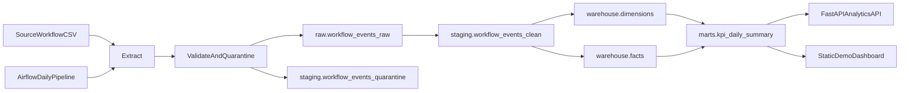

# OpsPulse Architecture

## Objective

OpsPulse turns workflow source files into warehouse-backed operational analytics that can be explored through SQL, FastAPI, Airflow, and a lightweight dashboard. The project is intentionally structured so each layer can be demonstrated independently or as a full end-to-end platform.

## High-Level Flow

## Pipeline Stages

### Extract

- reads generated workflow CSV files from `data/raw/` or a supplied path
- ensures source metadata columns are available for downstream lineage

### Validate

- checks required columns
- parses timestamps safely
- enforces lifecycle and SLA rules
- routes invalid records into quarantine

### Load Raw

- stores valid source records in `raw.workflow_events_raw`
- stores invalid rows in `staging.workflow_events_quarantine`

### Transform

- normalizes workflow fields
- deduplicates by `workflow_id`
- computes turnaround, age, SLA breach, and exception flags

### Load Warehouse

- upserts dimensions
- loads fact tables for workflows, exceptions, and backlog
- refreshes KPI mart slices used by the API and demo layer

## Airflow Orchestration

The Airflow DAG `opspulse_daily_pipeline` calls the same ETL modules used by the local CLI. It is structured into task groups for:

1. input readiness check
2. extract
3. validate
4. load raw
5. transform and load warehouse
6. data quality summary

This keeps orchestration logic thin and avoids duplicating ETL behavior.

## Warehouse Layers

- `raw`: immutable landed workflow source records
- `staging`: validated, typed, and deduplicated workflow records
- `warehouse`: dimensions and fact tables for operational analytics
- `marts`: KPI summary tables and reporting views for APIs and dashboards

## Core Tables

- `raw.workflow_events_raw`
- `staging.workflow_events_clean`
- `staging.workflow_events_quarantine`
- `warehouse.dim_team`
- `warehouse.dim_workflow_type`
- `warehouse.dim_priority`
- `warehouse.dim_status`
- `warehouse.dim_date`
- `warehouse.fact_workflow_run`
- `warehouse.fact_exception`
- `warehouse.fact_backlog_daily`
- `marts.kpi_daily_summary`
- `marts.v_team_performance_daily`
- `marts.v_open_exceptions`

## API Layer

The FastAPI service reads from warehouse facts and marts and exposes interview-friendly analytics endpoints for:

- health and DB connectivity
- KPI summary
- daily KPI slices
- open exceptions
- workflow lookup
- backlog snapshots
- team performance views

## Design Notes

- Raw records preserve lineage for reprocessing and debugging.
- Staging isolates validation and cleanup from downstream analytics logic.
- Facts and dimensions support workflow lookup, backlog, team performance, KPI reporting, and exception monitoring.
- KPI summaries are materialized into marts so APIs and demo tools query pre-aggregated data rather than rebuilding metrics on every request.
- The static demo dashboard is intentionally lightweight so the focus remains on data engineering and backend architecture.
