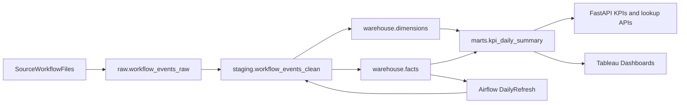

# OpsPulse Architecture

## Objective

OpsPulse models workflow operations data from ingestion through reporting so the next iterations can add ETL orchestration, FastAPI services, KPI APIs, and Tableau dashboards on top of a stable warehouse foundation.

## High-Level Flow

## Schemas

- `raw`: append-only source landing tables
- `staging`: validated, typed, and deduplicated records
- `warehouse`: star-schema dimensions and facts
- `marts`: KPI summaries and reporting views for APIs and dashboards

## Core Tables In This Milestone

- `raw.workflow_events_raw`
- `staging.workflow_events_clean`
- `warehouse.dim_team`
- `warehouse.dim_workflow_type`
- `warehouse.dim_priority`
- `warehouse.dim_status`
- `warehouse.dim_date`
- `warehouse.fact_workflow_run`
- `warehouse.fact_exception`
- `warehouse.fact_backlog_daily`
- `marts.kpi_daily_summary`

## Design Notes

- Raw records preserve ingestion metadata for reproducibility and reprocessing.
- Staging separates validation and standardization from downstream business logic.
- Facts and dimensions support the required endpoints for workflow lookup, backlog, team performance, KPI reporting, and exception monitoring.
- KPI summaries are materialized into marts so APIs and Tableau can query stable, pre-aggregated metrics.
